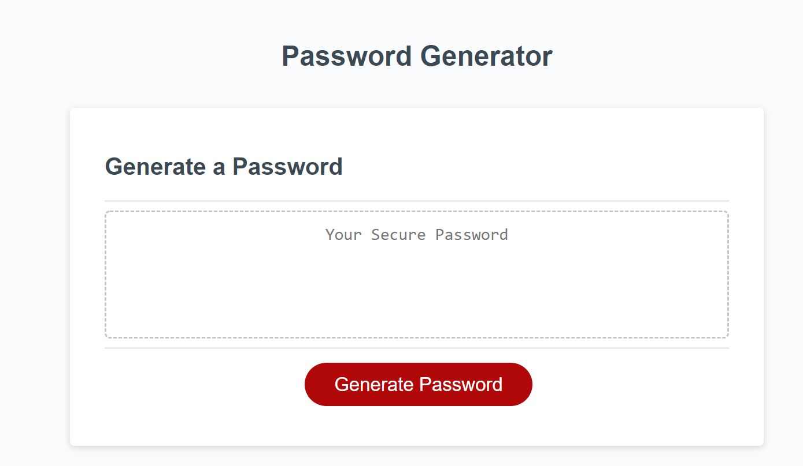
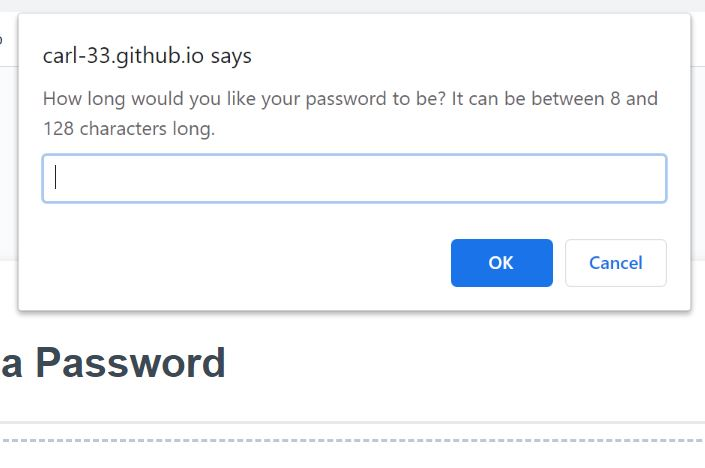
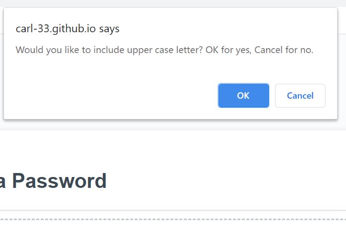
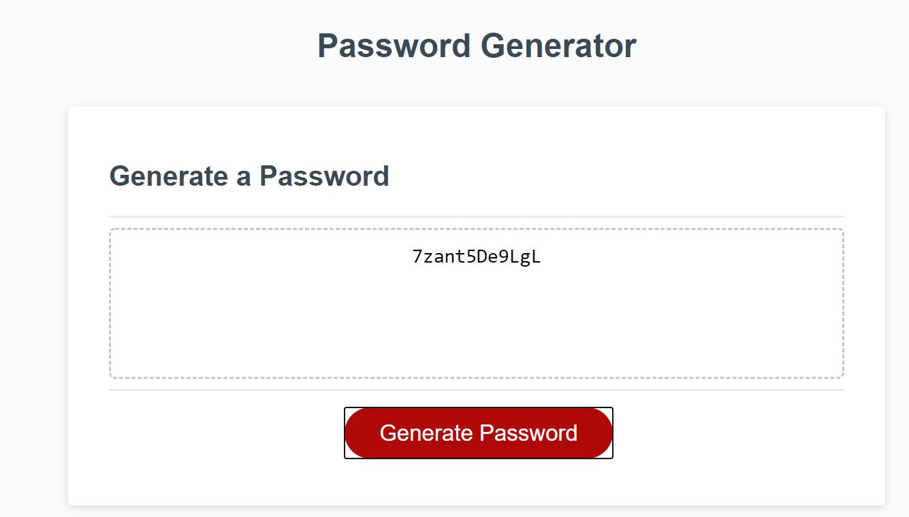

# Password-Generator

This is a password generator made using javascript.  The javascript works with HTML and CSS files I was provided.

## Link

https://carl-33.github.io/Password-Generator/

## Usage Instructions

Click on the red Generate Password button as seen below.

A series of prompts will appear, starting with the ability to determine the length of the password.  Numbers between 8 and 128 are accepted.

Followed by four confirming prompts for which characters the user wants included in the password, click OK to include the characters, and Cancel to omit them.  The four character options are upper case letters, lower case letter, numbers, and special characters.

Finally, your new password will appear in the box!

## Installation Instructions

N/A

## Credits/Thanks

Thanks to Josh Thorngren for helping me get started. And thanks to Eric Osowski and Tsin Moua for help troubleshooting. 
